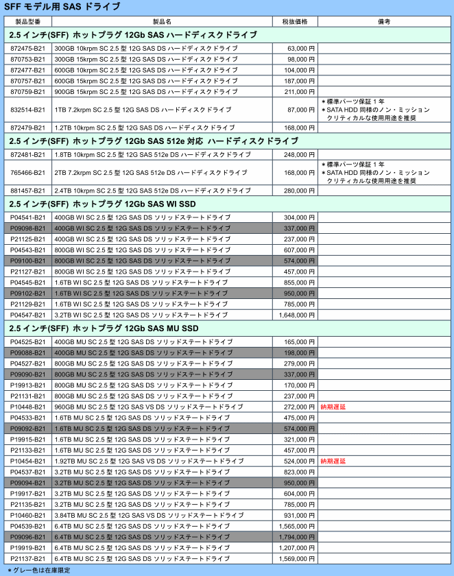

# 2. 筐体
* 構成ガイドを見よ
* もう2ソケット筐体は選ばない。
* LOMを見よ
* 増設スロット
* ベゼルいらない。ケーブルマネージメントアームいらない。ラックレールはスライドする一番安いやつ。DVDもいらないケースあり。
* 2.5インチベイのものを選択する。3.5インチは下火、種類が少ない、条件に合致しない。

## 構成ガイドを見よ
<a href="https://www.hpe.com/content/dam/hpe/shared-publishing/images-norend/jp/pdf/system/servers/dl361gen10.pdf" target="_blank">DL360 Gen10</a>  
<a href="https://japancatalog.dell.com/c/wp-content/uploads/PER6515configguide.pdf" target="_blank">Dell R6515</a>  

* 客先に合った奥行きを必ずチェック
* PCIライザーなどの組み合わせ方法の確認
* LOMの確認
* その他すべての組み合わせ可能なハードウェアが載っている

## もう2ソケット筐体は選ばない。
ダイあたりのコア数が2桁を超えるのが普通の時代になり、ソケット数を考慮する必要がなくなった。明確にコストが安い1ソケットを選択すべき。

## LOMを見よ
LOM(LAN On Motherboard)≒標準NICで、HP DL360であれば1GE 4ポート、Dell R6515であれば25GE 2ポート（!?）が標準でついている。これは他のインターフェースに変更できる。
* 追加NICを考える前にこれを見よう
* Dellは1GE 2portにするとものすごく値段が下がる

## 増設スロット
NIC等を追加する場合、増設スロットをPCIライザーの組み換えで増やすケースがある。
* 例：Dell R6515では標準で4portの1GbEを持つことができるが、ライザーなし、1スロット増設ライザー、2スロットライザーの3種類選択できる。最大12portの1GbEを搭載できる

(参考) 1GbE 4ポートNICをはじめとして、メーカーを選べるケースがある場合はBroadComを避け、Intelにする。ない場合はMellanox等（SFP等にも注意）。特に新しいモデルのNICはBroadComだと非常にトラブるので注意。

## ベゼルいらない。ケーブルマネージメントアームいらない。ラックレールはスライドする一番安いやつ。DVDもいらないケースあり。
* ベゼル、ケーブルマネージメントはいらないよね？
* ラックレールは固定のものを選ぶと後悔するので一番安いスライドのもの
* PXEブートによる復旧体制等の場合、DVDドライブがあるとインストール終了後勝手に開くなどの害があるので注意

## 2.5インチベイのものを選択する。3.5インチは下火、種類が少ない、条件に合致しない。
* 2.5インチのほうが明らかに選択肢が多い。同一容量・回転数であればほぼ同じ価格。

DL360 SFF(SAS 2.5インチドライブ筐体)とLFF(SAS 3.5インチドライブ筐体)の比較  
ただし、SFFは2ページ目あるが割愛  

